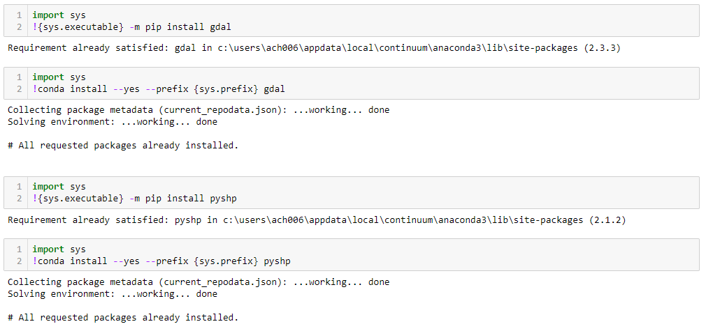
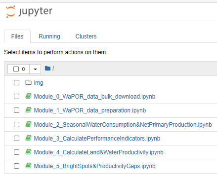
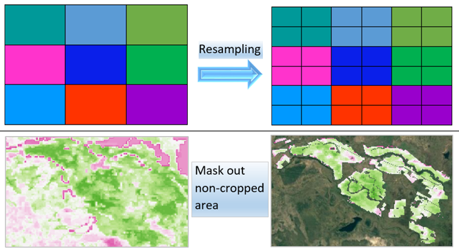

[](https://doi.org/10.5281/zenodo.3980715)

# <font color='#ff009a'> Standardized protocol for land and water productivity analyses using WaPOR</font> 
### Version 1.1
**Project**: ***Water Productivity Improvement in Practice (Water-PIP)***
<br/>**Prepared by IHE Delft**
<br/>**October 2020**


**Authors:** 
* Abebe D. Chukalla (a.chukalla@un-ihe.org),
* Marloes Mul, 
* Bich Tran,
* Poolad Karimi

With contributions from: Quan Pan, Lauren Zielinski, Solomon Seyoum

**Cite as:** 
Chukalla A.D., Mul M., Tran, B., Karimi, P. wateraccounting/WAPORWP: Standardized protocol for land and water productivity analyses using WaPOR (v1.1). Zenodo. http://doi.org/10.5281/zenodo.4641360, October 2020.

# 1	Introduction 
The project Water Productivity Improvement in Practice (Water-PIP) aims to facilitate the increase in crop water productivity in DGIS partner countries in Africa and Near East and Northern Africa (NENA) region. It also aims to connect IT business solutions to the WaPOR database to improve the analyses and provide more insight into the database for practical applications. It will also capture practical solutions and link agribusinesses to improve land and water productivity. 

The **Standardized protocol for land and water productivity analyses using WaPOR** is aimed at guiding users to understand the different layers contained in the FAO Water Productivity Open-access portal (WaPOR) which can be used for land and water productivity analyses. It provides python scripts which can be used to calculate land and water productivity and other performance indicators such as uniformity, efficiency (beneficial fraction), adequacy, relative water deficit as well as estimating productivity gaps. For each step, the protocol provides information about the assumptions used and provides links to reference materials.

## 1.2	WaPOR data
FAO’s portal to monitor Water Productivity through Open-access of Remotely sensed derived (WaPOR) was “created to provide relevant and specific information on water and biomass status to develop solutions to sustainably increase agricultural land and water productivity” . WaPOR is the first comprehensive dataset that combines water use (actual evaporation, transpiration and interception), production (net primary production), land use (land cover classification), phenology, climate (precipitation and reference evapotranspiration) and water productivity layers covering sub-Saharan Africa and the Near East and North African regions. The data is available at decadal time steps and in near real-time for the period between 2009 to present day. WaPOR datasets are available at the continental scale (Level 1 at 250 m), country and river basin (Level 2 at 100 m) and project level (Level 3 at 30 m). The latest WaPOR portal (WaPOR v2.1), was improved from WaPOR v1.0 following the independent quality assessment by IHE Delft and ITC (FAO and IHE, 2019). The methodology used for compiling the WaPOR database is provided in FAO (2020a).  

## 1.3	Ground data
Ground data such as the boundary of the farm (to download WaPOR data and filter non cropped area), moisture content of fresh biomass (to convert dry matter to biomass), above ground over total biomass (to estimate the above ground biomass), start and end of seasons (to aggregate water and climate data per crop season), harvest index (to derive crop yield from above ground biomass) and crop coefficient (to estimate potential evapotranspiration from reference evapotranspiration) are required. 
 
## 1.4	Protocol: scope and target audience 
<br/>**Scope:** The protocol is tailored to biophysical water productivity with respect to consumed water use and land productivity at areas (fields, and schemes) in similar agro-climatic zones. The protocol can be applied to single water management unit and crop production regardless of the water sources (e.g. from exclusively rainfall (rainfed), or irrigation (augmented through surface water and/or groundwater, or flood /spate)). The protocol is developed for agricultural areas with a single crop and same cropping season, which can vary between years. Implementing the protocol beyond fields/ scheme level such as a river basin and country levels, which could fall in different agro-climatic zones, require normalization for climate variation – which is outside the scope of the protocol.     
<br/>**Target**: The protocol is developed for project leads, irrigation managers and researchers who have a basic understanding of python and agricultural practices.   

# 2	Installation requirements
The scripts to download and process the WaPOR data for land and water productivity assessment are developed in the python programming language. The scripts can be downloaded from the water accounting repository on GitHub  and run in Jupyter Notebook. Beginners of python programming are advised to follow the OCW of IHE Delft on python scripting before starting with implementing the provided scripts . A beginning programmer should be able to run the scripts, it is advised to run them using Jupyter notebook. The following sections describe the installation requirements.  
## 2.1	Running from Jupyter notebook
### The requirement of the python and libraries used in the protocol
* python 3.7.3
* numpy 1.16.4
* pandas 0.24.2 
* GDAL 2.3.3
* pyshp 2.1.0 

## 2.2	Install python, Jupyter notebook and libraries (packages)
#### i) Install python and jupyter notebook using the Anaconda distribution: https://www.anaconda.com/products/individual
Use the anaconda installer, which is tailored to different operating system: window (64-Bit and 32-Bit), MacOS (64-Bit) or Linux system.
>Read more on Jupyter notebook: https://jupyter.org/, https://packaging.python.org/overview/
**Steps to run Jupyter notebook** refer from https://github.com/wateraccounting/WAPOROCW/blob/master/README.md

#### ii) Install packages: 
##### Packages such as GDAL, pyshp can be installed using pip or conda. 
>a) **Pip** is the Python Packaging Authority’s recommended tool for installing packages from the Python Package Index (PyPI), which is a repository of software for the Python programming language (https://pypi.org/). Pip installs python packages in any environment. Type the following codes to Install a pip package in the current Jupyter kernel: 
> <br/> <font color='#0d00ff'>import sys </font>
> <br/> <font color='#0d00ff'>!{sys.executable} -m pip install 'package' </font>

>b) **Conda** is a cross platform package and environment manager that installs and manages conda packages from the Anaconda repository (https://repo.anaconda.com/) and the Anaconda Cloud (https://anaconda.org/). Conda installs any package in conda environments. Type the following codes to Install a conda package in the current Jupyter kernel:
> <br/> <font color='#0d00ff'>import sys </font>
> <br/> <font color='#0d00ff'>!conda install --yes --prefix {sys.prefix} 'package' </font>
More tutorials on **conda** commands: https://docs.conda.io/projects/conda/en/latest/user-guide/index.html
> <br/> Example: screen shot of installing gdal package


# 3	Structure of the protocol 
The protocol has six modules, which are described in detail in the following sections. For each of the modules, a Jupyter notebook was developed, containing the scripts. Module 0 focuses on downloading WaPOR data on actual water consumption (ET), actual transpiration, reference evapotranspiration and net primary production. In Module 1, the pre-processing of the data to match the spatial resolution and remove non-crop pixels is conducted. In Module 2, the seasonal water consumption (transpiration, actual evapotranspiration, reference evapotranspiration and potential evapotranspiration) and seasonal net primary production are computed. In Module 3, different performance indicators are calculated. In Module 4, land and water productivity are computed. And finally in Module 5, bright spots and productivity gaps are calculated.  

,  

**Figure 1.** Flow chart for downloading WaPOR data and calculate performance indicators, land and water productivity and productivity gaps (top) and a screenshot of the Jupyter notebook for the six modules (bottom). 

## 3.1	Download WaPOR data (Module 0)
**Notebook:** https://github.com/wateraccounting/WAPORWP/blob/master/Notebooks/Module_0_WaPOR_data_bulk_download.ipynb
##### Step 0a Import modules/libraries
##### Step 0b Read the geographical extent of the study area
##### Step 0c Bulk-download WaPOR data for the study area extent


## 3.2	Pre-processing WaPOR data (Module 1) 
**Notebook:** https://github.com/wateraccounting/WAPORWP/blob/master/Notebooks/Module_1_WaPOR_data_preparation.ipynb
##### Step 1a Import modules/libraries 
##### Step 1b Resample raster data 
##### Step 1c Filter non-cropped area using land cover map and project boundary 
 


## 3.3	Computing Seasonal Water Consumption & Net Primary Production (Module 2) 
**Notebook:** http://localhost:8888/notebooks/Module_2_SeasonalWaterConsumption%26NetPrimaryProduction.ipynb
##### Step 2a Set up: Import modules/libraries 
##### Step 2b Defining function and crop season
##### Step 2b Calculate seasonal T, ET, RET, ETp, NPP 

## 3.4	Calculate performance indicators (Module 3)
**Notebook:** http://localhost:8888/notebooks/Module_3_CalculatePerformanceIndicators.ipynb
This module is used to calculate a number of performance indicators, namely uniformity, beneficial fraction, adequacy and relative water deficit.  
##### Step 3a Set up 
##### Step 3b Calculate Uniformity and Equity
##### Step 3c Calculate Efficiency (Beneficial fraction)
##### Step 3d Calculate Adequacy
##### Step 3e Calculate Relative Water Deficit

## 3.5	Land and water productivity (Module 4)
**Notebook:** http://localhost:8888/notebooks/Module_4_CalculateLand%26WaterProductivity.ipynb
##### Step 4a Set up 
##### Step 4b Calculate land productivity: i) biomass and ii) crop yield
**Land productivity** is is defined as the above-ground biomass production or yield in ton/ha/season, which are estimated from the seasonal net primary production using the following equations: 

##### Step 4c Calculate i) biomass water productivity and ii) crop water productivity
**Biomass and crop Water productivity** is estimated as the ratio of above-ground biomass or yield over actual evapotranspiration. 

## 3.6	Productivity gaps and production projection (Module 5)
**Notebook:** http://localhost:8888/notebooks/Module_5_BrightSpots%26ProductivityGaps.ipynb
##### Step 5a Set up 
##### Step 5b Calculate the target productivity
##### Step 5c Identify bright spots 
The **bright spots** are fields that have both land and water productivity equal to or greater than the targets. The location of the bright spots is then mapped for the individual targets (biomass or yield and water productivity as well as areas where both targets are exceeded. 
##### Step 5d Calculate productivity gaps¶
**Productivity gap** is defined as the difference between productivity at the plot level and the target productivity; it is the maximum value from zero and target productivity minus the productivity at plot level. The production gap is defined as the sum of the land productivity gaps of a particular crop over area. The potential increase in biomass/ yield production of a particular crop in an area of interest is calculated by adding the productivity gap across the area. 

# 4	Example, Protocol applied at Xinavane irrigation scheme
### 4.1	Data
Case: crop = sugarcane, country = Mozambique, project = Xinavane
WaPOR and local data of Table 6 are used to implement the protocol. The Level 2 data used in this study include actual evapotranspiration and interception and net primary production at a decadal timescale and annual land cover classification. In addition, decadal precipitation at 5 km resolution, decadal reference evapotranspiration at 25 km resolution. The precipitation and reference evapotranspiration datasets were downscaled to 100 m resolution.


### 4.2	WaPOR data consistency 
The Level 2 data source of the WaPOR data is not consistent throughout the 10 years. Before 2014, the data is derived from the MODIS satellite (250 m resolution), which is resampled to 100 m. In 2014, PROBA-V came into orbit, which provides the WaPOR L2 data for the period after 2014. The analyses in this report show a clear break 2009-2013 and 2014 onwards in the data (e.g., the noise in the biomass-transpiration and biomasses relationship are much even with patch of scatter pixels, such as high biomass at zero transpiration which cannot be explained agronomical).   

### 4.3	Results
 
 


# 5	References
<br/>Allen, R. G., Pereira, L. S., Raes, D., and Smith, M.: Crop evapotranspiration-Guidelines for computing crop water requirements-FAO Irrigation and drainage paper 56, Fao, Rome, 300, D05109, 1998.
<br/>Bastiaanssen, W. G., Van der Wal, T., and Visser, T.: Diagnosis of regional evaporation by remote sensing to support irrigation performance assessment, Irrigation and Drainage Systems, 10, 1-23, 1996.
<br/>Doorenbos, J., and Kassam, A.: FAO irrigation and drainage paper No. 33 “Yield response to water”, FAO–Food and Agriculture Organization of the United Nations, Rome, 1979.
<br/>FAO. 2020. WaPOR database methodology: Version 2 release, April 2020. Rome. https://doi.org/10.4060/ca9894en
<br/>Karimi, P., Bongani, B., Blatchford, M., and de Fraiture, C.: Global satellite-based ET products for the local level irrigation management: An application of irrigation performance assessment in the sugarbelt of Swaziland, Remote Sensing, 11, 705, 2019.
<br/>Smith, D., Inman-Bamber, N., and Thorburn, P.: Growth and function of the sugarcane root system, Field Crops Research, 92, 169-183, 2005.
<br/>Villalobos, F. J., and Fereres, E.: Principles of agronomy for sustainable agriculture, Springer, 2016.

```python

```
